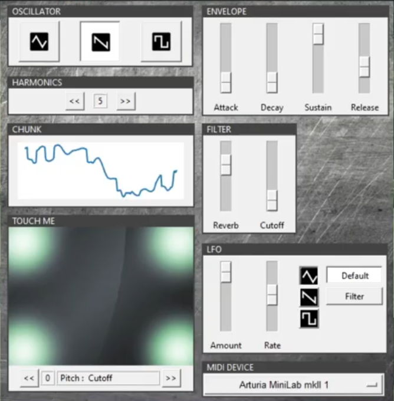

# PyBlaster (aka Eardrum Blaster)
### Digital Synthesizer written in Python

Pyblaster is a monophonic syntheziser with Midi, ADSR, LFO and Filters (Lowpass and Reverb). It's inspired by Korg's Kaossilator series and provides a touchpad which controls two parameters simultaniously (eg. Pitch and Lowpass).
It can also be used with a Midi Keyboard.

  

### Features
- 3 Waveforms 
    - Triangle, Sawtooth, Rectangular
- 4 Phase Envelope 
    - Attack, Decay, Sustain, Release
- Filter: Low-Pass, Reverb
- Midi-In
- LFO (to controll pitch or low-pass)
- version with GUI and version which can be run from console

___

##### How to use

install all required libraries

- Pyaudio
- tkinter
- Python 3
- python-rtMidi
- Scipy
- numpy

run with gui: `python3 /synthlogic/main/synth_gui.py`

*OR*
 
run without gui: `python3 /synthlogic/main/synth_no_gui.py`

change settings of synth in `config.ini`
___

##### How to install on Raspberry Pi
running the synthesizer on your Raspberry Pi is currently experimental.
It will run but it's not optimized for it. It was testet on a *Raspberry Pi 2 B*.
For those who still want to try it out, here is a tutorial how to install it:
http://denicz.info/2020/11/04/how-to-install-eardrum-blaster-on-raspberry-pi/

___
##### Planned features
- remove library Scipy and replace waveform synthesis with own implementation
- paraphony
- optimize performance on Raspberry Pi
